# OpenFront core gameplay logic

Every rule the deterministic simulation applies, mapped as Mermaid flowcharts. Source of truth is
`src/core/execution/*` and `src/core/game/PlayerImpl.ts`; constants are from `src/core/configuration/Config.ts`
(there is no `DefaultConfig.ts` — the `Config` class *is* the default). 1 tick = 100 ms, so `N*10` ticks = N seconds.

Renders on GitHub, VS Code, Obsidian, or paste a block into https://mermaid.live.

**Contents**

1. [Intent → Execution dispatch](#1-intent--execution-dispatch)
2. [Execution lifecycle](#2-execution-lifecycle)
3. [Spawn phase](#3-spawn-phase)
4. [PlayerExecution — the per-player tick](#4-playerexecution--the-per-player-tick)
5. [AttackExecution — land combat](#5-attackexecution--land-combat)
6. [Retreat](#6-retreat)
7. [Transport ships — naval invasion](#7-transport-ships--naval-invasion)
8. [Warships](#8-warships)
9. [Shells](#9-shells)
10. [Ports and trade ships](#10-ports-and-trade-ships)
11. [Construction, upgrade, delete](#11-construction-upgrade-delete)
12. [Missile silos, nukes, MIRV](#12-missile-silos-nukes-mirv)
13. [SAM launchers](#13-sam-launchers)
14. [Rail network and trains](#14-rail-network-and-trains)
15. [Alliances and betrayal](#15-alliances-and-betrayal)
16. [Donations, embargo, targeting, emoji, chat](#16-donations-embargo-targeting-emoji-chat)
17. [Win check](#17-win-check)
18. [Doomsday clock](#18-doomsday-clock)
19. [Query surface — playerActions](#19-query-surface--playeractions)
20. [Query surface — buildableUnits](#20-query-surface--buildableunits)
21. [Timers and cooldowns](#21-timers-and-cooldowns)
22. [Who spawns what](#22-who-spawns-what)

---

## 1. Intent → Execution dispatch

`Executor.createExec` (`src/core/execution/ExecutionManager.ts:51-141`). The only guard here is "does this client have a player" — every Execution validates itself in `init()`/`tick()`.

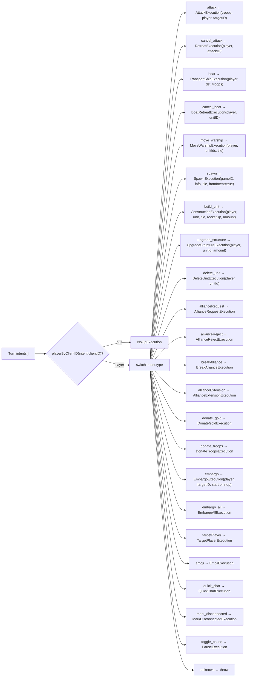

Standing executions created by `GameRunner.init()`: `SpawnTimerExecution` (multiplayer only), one `NationExecution` per nation, `SpawnExecution` per human (random-spawn only), `SpawnExecution` per tribe (`config.bots()`), `WinCheckExecution`, `DoomsdayClockExecution` (if enabled), `RecomputeRailClusterExecution` (if Factory not disabled).

---

## 2. Execution lifecycle

`GameImpl.executeNextTick` (`src/core/game/GameImpl.ts:487-532`). The spawn-phase gate is the single most important rule: almost every execution has `activeDuringSpawnPhase() === false`, so intents sent during spawn are **queued, not run**, until the phase ends.

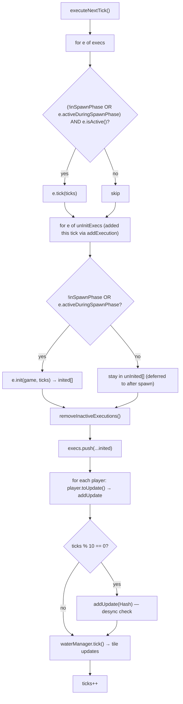

Consequences:
- An execution added at tick T is `init`ed at the end of T and first `tick`s at T+1.
- If `init()` leaves `isActive()` false, the execution is dropped and never ticks (this is how most validation failures work).
- Several executions do all their work in `init()` and report `isActive() === false` forever: `MoveWarship`, `UpgradeStructure`, `AllianceExtension`, `EmbargoAll`, `Pause`, `MarkDisconnected`, `NoOp`.

---

## 3. Spawn phase

```mermaid
flowchart TD
    subgraph Timer["Who ends the spawn phase"]
        T1{"gameType?"}
        T1 -- Singleplayer --> T2["no SpawnTimerExecution.<br/>Human's SpawnExecution calls endSpawnPhase()"]
        T1 -- Multiplayer --> T3["SpawnTimerExecution: ticks > numSpawnPhaseTurns() → endSpawnPhase()<br/>randomSpawn 150, else 300 ticks"]
    end

    subgraph SE["SpawnExecution.tick() — runs exactly once"]
        S0["tile given AND !isValidRef(tile) → return"]
        S0 --> S1["player = hasPlayer ? player : addPlayer(info)  (tribes are added here)"]
        S1 --> S2{"fromIntent AND !queuedDuringSpawnPhase?"}
        S2 -- yes --> SX["return — late client spawn ignored"]
        S2 -- no --> S3{"isRandomSpawn AND player.hasSpawned?"}
        S3 -- yes --> SX
        S3 -- no --> S4["relinquish all current tiles (re-pick)"]
        S4 --> S5{"random spawn?"}
        S5 -- no --> S6["tiles = all valid tiles within radius 4 of clicked tile<br/>(unowned, land, passable)"]
        S5 -- yes --> S7["up to 1000 tries: random tile in team area or map<br/>land, unowned, not map border<br/>tries ≤ 750: manhattan ≥ 30 from every other spawn<br/>ALL tiles within radius 4 must be valid"]
        S6 --> S8{"got tiles?"}
        S7 --> S8
        S8 -- no --> SX
        S8 -- yes --> S9["player.conquer each tile"]
        S9 --> S10{"first spawn for this player?"}
        S10 -- yes --> S11["addExecution(PlayerExecution)<br/>Bot → also TribeExecution"]
        S10 -- no --> S12
        S11 --> S12["setSpawnTile(center)"]
        S12 --> S13{"Singleplayer AND Human?"}
        S13 -- yes --> S14["mg.endSpawnPhase()"]
    end
```

Starting manpower (`startManpower`): Bot 10k; Nation Easy 12.5k / Medium 18.75k / Hard 25k / Impossible 31.25k; Human 25k.
Spawn immunity: Humans and Nations cannot be attacked by humans during spawn phase + 50 ticks after (`isImmune`). Bots are never immune.

---

## 4. PlayerExecution — the per-player tick

One per spawned player (`src/core/execution/PlayerExecution.ts`). This is where income, alliance expiry, embargo expiry, structure capture and enclave removal happen.

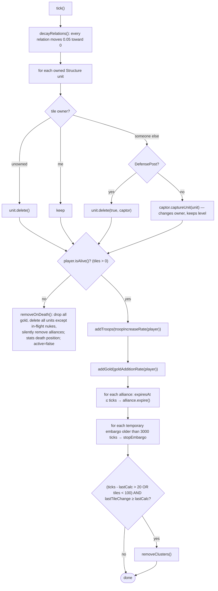

### Economy formulas

```
maxTroops = 2 * (tiles^0.6 * 1000 + 50000) + Σ city.level * 250_000
            Bot ÷3 · Nation Easy ×0.5 / Medium ×0.75 / Hard ×1 / Impossible ×1.25

troopIncreaseRate:
    toAdd = 10 + troops^0.73 / 4
    toAdd *= (1 - troops / maxTroops)          ← logistic: growth → 0 at cap
    Bot ×0.5 · Nation Easy ×0.9 / Medium ×0.95 / Impossible ×1.05
    return min(troops + toAdd, maxTroops) - troops     (negative if over cap)

goldAdditionRate = (Bot ? 50 : 100) * goldMultiplier   per tick
```

### removeClusters — enclave capture

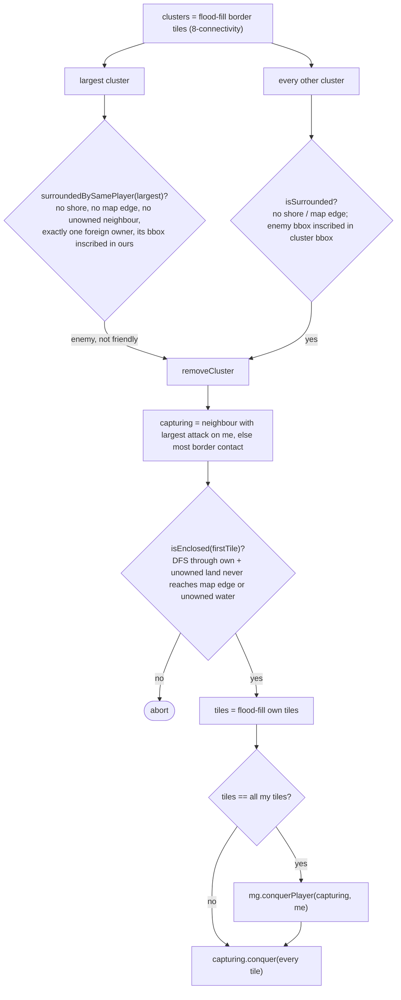

---

## 5. AttackExecution — land combat

`src/core/execution/AttackExecution.ts`. One per attack; boats create one with `sourceTile` set on landing.

### init — every guard, in order

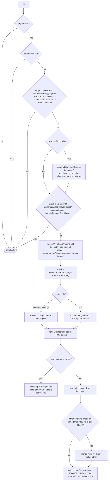

### tick — the conquest loop

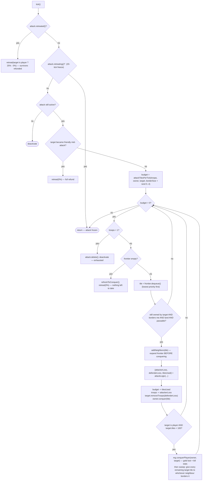

Frontier priority (lower dequeues first): `(rand 0..6 + 10) * (1 - 0.5*myNeighbours + terrainMag/2) + ticks` — flat terrain and tiles already surrounded by me go first; `+ticks` keeps older frontier ahead of newly discovered tiles.

### Combat formulas (`Config.attackLogic`, `attackTilesPerTick`)

```
attackTilesPerTick:
    vs player:        clamp(5*attackTroops/defenderTroops * 2, 0.01, 0.5) * adjacentEnemyTiles * 3
    vs terra nullius: adjacentEnemyTiles * 2

attackLogic per tile:
    base by terrain:  Plains mag 80 speed 16.5 · Highland 100 / 20 · Mountain 120 / 25
    defender has a DefensePost within 30 of tile:  mag ×5, speed ×3
    fallout on tile:  both × (5 - falloutRatio*2)
    defender disconnected AND same team:  mag = 0
    Human/Nation attacking a Bot:  mag ×0.7

    vs player:
        defenseSig   = 1 - sigmoid(defenderTiles, k=ln2/50000, mid=150_000)
        bigDefDebuff = 0.7 + 0.3*defenseSig                (large defenders are weaker)
        bigAtkBonus  = attackerTiles > 100k ? sqrt(100k/tiles)^0.7 : 1
        bigAtkSpeed  = attackerTiles > 100k ? (100k/tiles)^0.6 : 1
        traitorMod   = defender.isTraitor ? 0.5 : 1
        defenderLoss = defenderTroops / defenderTiles
        cur = clamp(defenderTroops/attackTroops, 0.6, 2) * mag * 0.8 * bigDefDebuff * bigAtkBonus * traitorMod
        alt = 1.3 * defenderLoss * (mag/100) * traitorMod
        attackerLoss = 0.6*cur + 0.4*alt
        tilesUsed    = clamp(defenderTroops/(5*attackTroops), 0.2, 1.5) * speed * bigDefDebuff * bigAtkSpeed * (traitor ? 0.8 : 1)

    vs terra nullius:
        attackerLoss = Bot ? mag/10 : mag/5 ;  defenderLoss = 0
        tilesUsed    = clamp(2000 * max(10, speed) / attackTroops, 5, 100)
```

`conquerPlayer(conqueror, conquered)`: Bot/Nation lose all gold to conqueror; Human loses all gold, conqueror receives half; humans who never sent an attack yield nothing. Disconnected teammates hand over warships and boats.

---

## 6. Retreat

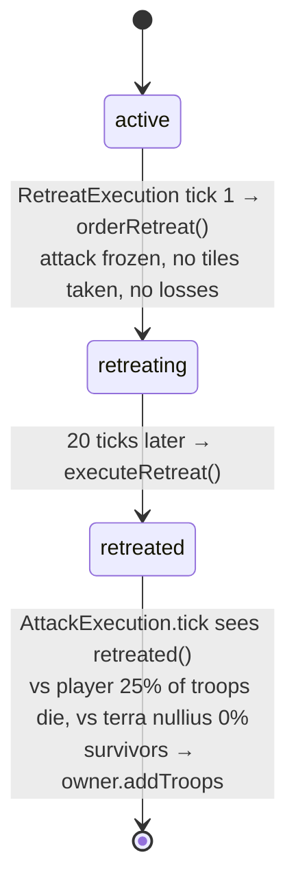

---

## 7. Transport ships — naval invasion

`src/core/execution/TransportShipExecution.ts`. Troops are deducted at `buildUnit`, so every ending refunds from the boat, not the player.

```mermaid
flowchart TD
    subgraph INIT["init()"]
        A["!isValidRef(dst) → deactivate"] --> B{"unitCount(TransportShip) ≥ 3?"}
        B -- yes --> B1["message no_boats_available; deactivate"]
        B -- no --> C["neither side Bot → reject target's pending alliance request"]
        C --> D{"target == me?"}
        D -- yes --> X([deactivate])
        D -- no --> E{"target player AND !canAttackPlayer?"}
        E -- yes --> X
        E -- no --> F["troops ??= floor(troops/5); troops = min(troops, mine)"]
        F --> G["landing = closestReachableShore(target, me, clicked tile, ≤50 manhattan)"]
        G --> G1{"null?"}
        G1 -- yes --> X
        G1 -- no --> H["src = canBuild(TransportShip, landing) → closestShoreByWater(me, landing)"]
        H --> H1{"false?"}
        H1 -- yes --> X
        H1 -- no --> I["boat = buildUnit(TransportShip, src, {troops}) — troops leave player NOW"]
        I --> J["record motion plan (full water path); UnitIncoming message to target"]
    end

    subgraph TICK["tick()"]
        T0{"boat sunk?"} -- yes --> TX([deactivate — troops lost])
        T0 -- no --> T1["original owner disconnected AND boat inherited by teammate → attacker = new owner"]
        T1 --> T2{"dst turned to water (nuke)?"}
        T2 -- yes --> T3["isRetreating = true; retreatDst = null"]
        T2 -- no --> T4
        T3 --> T4{"isRetreating?"}
        T4 -- yes --> T5["retreatDst ??= bestTransportShipSpawn(boat.tile)"]
        T5 --> T6{"no shore to return to?"}
        T6 -- yes --> T7["addTroops(100%); delete boat; deactivate"]
        T6 -- no --> T8["dst = retreatDst"]
        T4 -- no --> T9
        T8 --> T9["pathFinder.next(boat, dst)"]
        T9 --> R{"result"}
        R -- NEXT --> R1["boat.move(node); re-record plan if dst changed"]
        R -- NOT_FOUND --> R2["addTroops(100%); delete boat; deactivate"]
        R -- COMPLETE --> C1{"owner(dst) == me?  (came home)"}
        C1 -- yes --> C2["25% of troops die; addTroops(75%); delete boat"]
        C1 -- no --> C3["me.conquer(dst) — landing tile taken outright"]
        C3 --> C4{"target player AND friendly now?"}
        C4 -- yes --> C5["addTroops(100%) — reinforcement"]
        C4 -- no --> C6["addExecution(AttackExecution(troops, me, target, sourceTile=dst, removeTroops=false))"]
        C5 --> C7["delete boat; deactivate"]
        C6 --> C7
    end
```

`BoatRetreatExecution`: finds the unit by id among the player's own transport ships; sets `isRetreating = true`; one-shot. You can only retreat boats you currently own.

---

## 8. Warships

`src/core/execution/WarshipExecution.ts`. Spawn: `canBuild(Warship, patrolTile)` needs a water tile and an active, built port on the same water body; gold charged at `buildUnit`. Cost `min(1M, (n+1)*250k)`, 1000 HP.

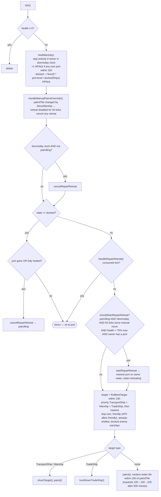

Trade-ship targeting extra filters: owner must have a usable port on this water body; ship not `isSafeFromPirates` (20 ticks after spawn or after hugging a shoreline); ship not heading to my/friendly port; ship inside my 100-tile patrol circle.

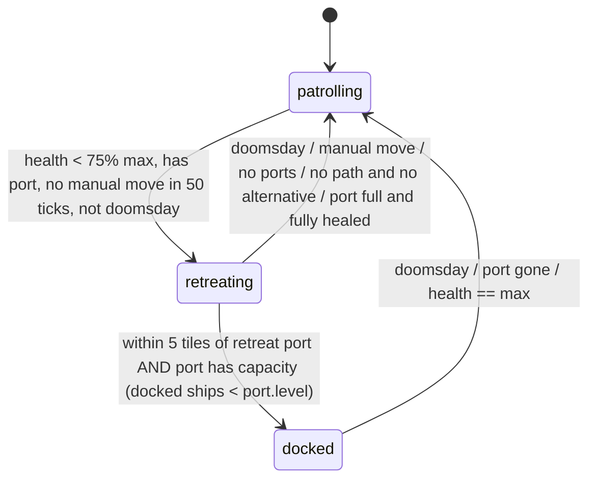

**shootTarget**: marks in-combat; fires a `ShellExecution` if `now - lastShot > 20` ticks — but shooting a **transport does not consume the reload**, and each transport gets exactly one shell (`alreadySentShell`). **huntDownTradeShip**: up to 2 moves/tick; capture at manhattan ≤ 5 → `captureUnit` + veterancy progress.

Veterancy: warship kill = +1 level immediately; transport kill +25 pts, trade capture +10 pts, 250 pts/level, max 3. Each level +20% max HP and +20% shell damage.

---

## 9. Shells

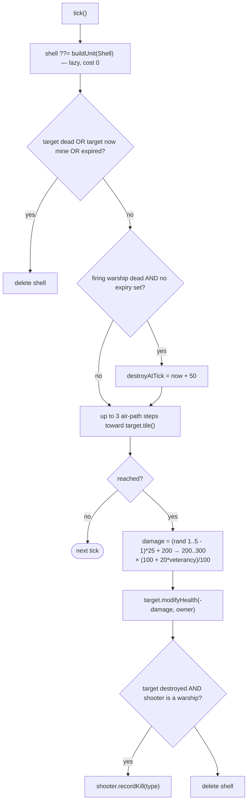

Transports and trade ships have 1 HP → any hit kills. A 1000-HP warship dies in 4–5 shells.

---

## 10. Ports and trade ships

### PortExecution

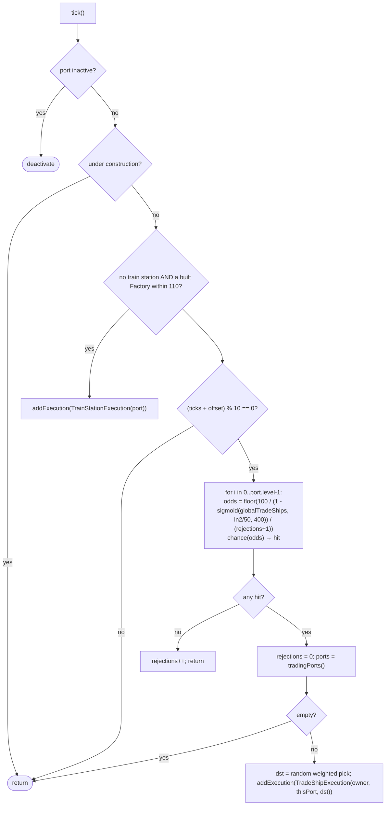

`tradingPorts()` weighting: every other player's port sharing a water body with mine, if `canTrade` (no embargo either way) — weight `level`, +`level` if among the nearest `clamp(n/3, 4, n)` ports **and** ≥ 300 manhattan away, +`level` if the owner is friendly and ≥ 300 away.

### TradeShipExecution

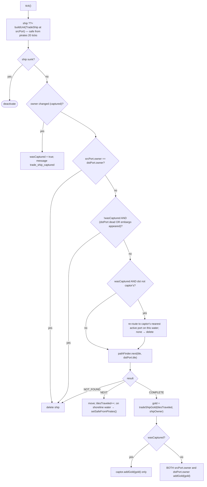

```
tradeShipGold(dist) = floor( (75_000 / (1 + e^(-0.03*(dist - 300))) + 50*dist) * goldMultiplier )
    dist 100 ≈ 5k · 300 = 52.5k · 500 ≈ 100k · 1000 ≈ 125k      (dist = tiles actually sailed)
```

---

## 11. Construction, upgrade, delete

### ConstructionExecution (`build_unit`)

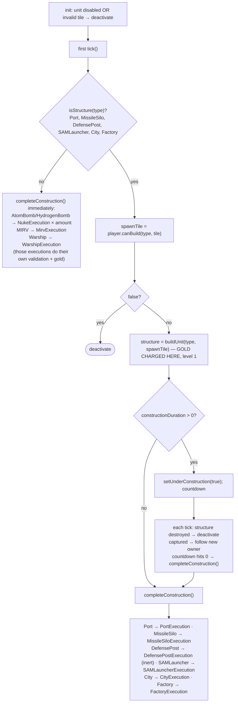

### Placement rules (`validStructureSpawnTiles`)

Click must be on own territory → candidate tiles = connected own tiles within euclidean 15 of the click → drop any within 15 of an existing structure (including under construction) → nearest wins. Port additionally needs a shore tile within 20 manhattan.

### Cost and build table

| Unit | cost(n), n = min(owned levels, ever built) | shares count with | build ticks | upgradable |
|---|---|---|---|---|
| City | `min(1M, 2^n × 125k)` | – | 20 | yes |
| Factory | `min(1M, 2^n × 125k)` | Port | 20 | yes |
| Port | `min(1M, 2^n × 125k)` | Factory | 50 | yes |
| DefensePost | `min(250k, (n+1) × 50k)` | – | 50 | **no** |
| MissileSilo | `1M` flat | – | 100 | yes (adds a missile slot) |
| SAMLauncher | `min(3M, (n+1) × 1.5M)` | – | 300 | yes (adds slot + range) |
| Warship | `min(1M, (n+1) × 250k)` | – | – | – |
| AtomBomb | `750k` | – | – | – |
| HydrogenBomb | `5M` | – | – | – |
| MIRV | `25M + 15M × mirvsLaunchedGlobally` | – | – | – |
| TransportShip, TradeShip, Shell, SAMMissile, Train, MIRVWarhead | 0 | | | |

Losing a structure lowers `n` (cheaper rebuild); each upgrade raises it. No level cap other than gold. Human with infinite-gold cheat pays 0.

### UpgradeStructureExecution / DeleteUnitExecution

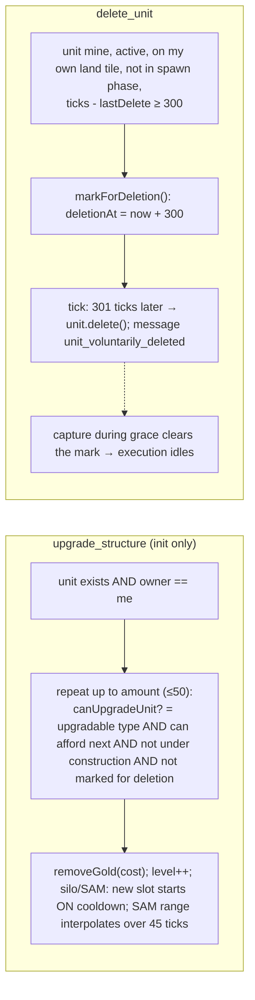

City and Factory executions do one thing: on first tick, if a built Factory is within 110 (city) / always (factory) → create a `TrainStationExecution`; a factory also promotes every built City/Port/Factory within 110 into a station. `DefensePostExecution` is inert — the ×5 defense / ×3 speed bonus is applied inside `attackLogic` for any defender post within 30 of the contested tile.

---

## 12. Missile silos, nukes, MIRV

### Silo cooldown model

A level-L silo has L slots. `launch()` pushes the tick; `isInCooldown()` when queue length == level. `MissileSiloExecution` reloads **one** slot per tick once `90 - (now - oldest) ≤ 0`. No range concept — `nukeSpawn` picks the **nearest ready silo**, unlimited distance.

### NukeExecution (AtomBomb, HydrogenBomb, MIRVWarhead)

```mermaid
flowchart TD
    subgraph FIRST["first tick"]
        A["spawn = canBuild(nukeType, dst) → nukeSpawn()"] --> A1{"false?<br/>spawn immunity active / impassable / teammate's tile /<br/>Team mode: teammate structure within outer radius / no ready silo"}
        A1 -- yes --> X([deactivate])
        A1 -- no --> B["silo stagger: nukes bought same tick from one silo depart 1 tick apart"]
        B --> C["nuke = buildUnit(type, src, {targetTile, trajectory}) — GOLD CHARGED<br/>trajectory = parabola, each point targetable iff within 150 of src or of dst"]
        C --> D["record motion plan"]
        D --> E{"not MIRVWarhead?"}
        E -- yes --> E1["maybeBreakAlliances():<br/>players with weighted blast tiles > 100 (inner=1, ring=0.5) OR any structure within outer<br/>→ reject their requests; break alliance (I become traitor); relation -100"]
        E --> F["owner of dst is a player → UnitIncoming message; stats bombLaunch"]
        F --> G["silo.launch()"]
    end
    subgraph LATER["subsequent ticks"]
        L0{"nuke inactive (SAM'd)?"} -- yes --> LX([deactivate])
        L0 -- no --> L1{"waitTicks > 0?"}
        L1 -- yes --> L2["waitTicks--"]
        L1 -- no --> L3["pathFinder.next(src, dst, speed)"]
        L3 --> L4{"COMPLETE?"}
        L4 -- no --> L5["update targetable flag; move; trajectoryIndex = current"]
        L4 -- yes --> L6{"enemy SAM missile within 12 of dst targeting me?"}
        L6 -- yes --> L7["wait one more tick"]
        L6 -- no --> DET["detonate()"]
    end
```

### detonate()

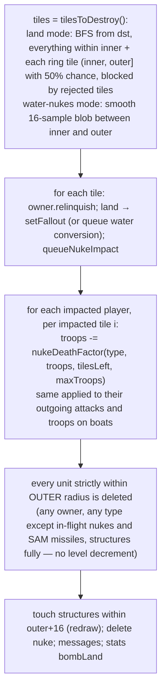

```
magnitudes: MIRVWarhead inner 12 outer 18 · AtomBomb 12 / 30 · HydrogenBomb 80 / 100
speed:      Atom/Hydrogen 10 · MIRV carrier 15 · MIRVWarhead 22 (+0..4 by index)
nukeDeathFactor per tile:
    Atom/Hydro:  5 * troops / max(1, tilesLeft)
    Warhead:     500 * (1 - e^(-2 * excess/maxTroops)),  excess = max(0, troops - 0.03*maxTroops)
```

### MirvExecution

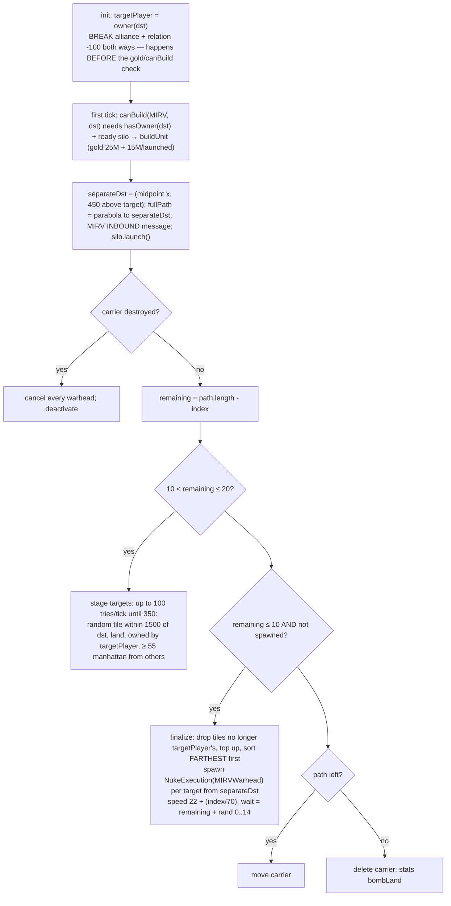

The MIRV carrier itself is never SAM-targetable; warheads are (they get trajectories ~10 ticks before separation).

---

## 13. SAM launchers

`src/core/execution/SAMLauncherExecution.ts`. **No hit chance** — a launched missile that reaches its planned interception tile always kills the nuke.

```
SAMCooldown 90 ticks · samRange(level) = 150 - 480/(level+5) → L1 70, L2 81, L3 90, L5 102, L10 118
upgrade: range interpolates linearly from old to new over 45 ticks
missile speed 12 tiles/tick · detection radius 600 · only trajectory points within 150 of launch site or target are targetable
```

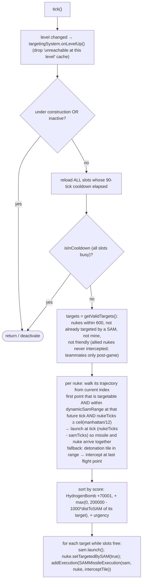

`SAMMissileExecution`: builds the missile and moves 12 tiles **in the same tick it was created**; each tick: if nuke dead / SAM dead / nuke now mine → un-flag nuke, delete missile; on reaching `interceptTile` → `nuke.delete(true, owner)`, message `missile_intercepted`, stats `bombIntercept`.

---

## 14. Rail network and trains

Constants: station link range 110, min 15, max railroad length ≈ 156 tiles, snap-to-existing-rail radius 3, max 4 station hops before a direct rail is considered.

```mermaid
flowchart TD
    subgraph ST["TrainStationExecution"]
        S0["constructor: unit.setTrainStation(true)"] --> S1["first tick: station = new TrainStation; railNetwork.connectStation():<br/>snap onto a railroad passing within 3 tiles (split it) — else<br/>rail to each built City/Factory/Port within 110 that is > 15 away and > 4 hops away; merge clusters"]
        S1 --> S2{"spawnTrains (factory only)?"}
        S2 -- yes --> S3["every tick: spawnTrain()"]
        S3 --> S4{"ticks ≥ lastSpawn + 10 AND cluster has a City/Port station that will trade with me?"}
        S4 -- yes --> S5["for i < level: chance((factories + 10) * 15) → spawn"]
        S5 --> S6["dest = random eligible trade station in cluster; addExecution(TrainExecution(owner, here, dest, 5 cars))"]
    end
    subgraph TR["TrainExecution"]
        T0["init: stations = A* over station graph; build engine + tail + 5 carriages; record train motion plan"] --> T1["each tick: 2 tiles along current railroad"]
        T1 --> T2{"embargo with next station appeared OR a station died?"}
        T2 -- yes --> T3["delete train"]
        T2 -- no --> T4{"reached a station?"}
        T4 -- yes --> T5["City/Port stop → trainGold paid: train owner always; station owner too if different<br/>then continue to next station or finish"]
    end
    RC["RecomputeRailClusterExecution: every tick, re-BFS dirty clusters so removed stations split clusters"]
```

```
trainGold(relation, stopsVisited):
    penalised = max(0, stopsVisited - 9)          (first 10 stops free)
    base = ally 35k · team/other 25k · self 10k
    gold = max(5k, base - 5k * penalised) * goldMultiplier   — paid at EVERY City/Port passed
```

---

## 15. Alliances and betrayal

```mermaid
flowchart TD
    subgraph REQ["AllianceRequestExecution"]
        A["init: canSendAllianceRequest(recipient)?"] --> A1{"recipient already has an outgoing request to me?"}
        A1 -- yes --> A2["accept theirs → alliance formed<br/>relation +100 both ways; end temporary embargoes both ways<br/>cancel in-flight nukes between us that would break the alliance"]
        A1 -- no --> A3["createAllianceRequest (pending)"]
        A3 --> A4["tick: accepted/rejected → done<br/>unanswered 200 ticks → auto-reject"]
    end
    subgraph LIFE["AllianceImpl"]
        L1["expiresAt = createdAt + allianceDuration (3000, or custom 1..15 min)"] --> L2["PlayerExecution: expiresAt ≤ ticks → expire() — no penalty, AllianceExpired event"]
        L1 --> L3["AllianceExtensionExecution: each side flags agree<br/>one side → wants_to_renew message to the other<br/>both → extend(): expiresAt = now + duration, flags reset<br/>(client only shows the button in the last 300 ticks)"]
    end
    subgraph BRK["BreakAllianceExecution"]
        B1["alliance exists?"] --> B2{"other is traitor OR disconnected?"}
        B2 -- no --> B3["breaker.markTraitor(): 300 ticks<br/>defenders lose only ×0.5 vs traitor; attacks advance ×0.8 faster"]
        B2 -- yes --> B4["no traitor mark"]
        B3 --> B5["victim relation -100; every neighbour not on victim's team: -40"]
        B4 --> B5
    end
```

Other alliance-affecting rules: attacking a target rejects their pending request to you and puts a **temporary embargo** (5 min) on you; an alliance formed mid-attack makes the attack retreat with no losses; nuking near an ally's structures or > 100 weighted tiles breaks the alliance at launch (you become traitor); MIRV breaks it at `init` even if the launch then fails.

---

## 16. Donations, embargo, targeting, emoji, chat

```mermaid
flowchart LR
    subgraph GOLD["DonateGoldExecution"]
        G1["gold ??= sender.gold/3"] --> G2["canDonateGold: friendly, both alive, config allows for humans, 100-tick per-recipient cooldown (shared with troops)"]
        G2 --> G3["removed = min(gold, have); recipient += removed"]
        G3 --> G4["relation += min(5 * chunks, 100)<br/>chunk = difficulty size (2.5k/5k/12.5k/25k) growing ×(1 + ticks/(3000+spawnTurns))"]
        G4 --> G5["Nation recipient replies with an emoji: ≥50 love, >0 thumbs-up, else too-small"]
    end
    subgraph TROOP["DonateTroopsExecution"]
        T1["troops ??= sender.troops/3; capped at recipient's free cap; ≤0 → dropped"] --> T2["canDonateTroops (same gates)"]
        T2 --> T3["recipient += removed"]
        T3 --> T4["troops ≥ random threshold (Easy max/13..max/11 … Impossible max/7..max/5) → relation +50"]
    end
    subgraph EMB["Embargo"]
        E1["embargo: start → permanent embargo; stop → remove. No checks, no cooldown"]
        E2["embargo_all: canEmbargoAll (100-tick cooldown, someone eligible exists) → every alive non-bot non-teammate"]
        E3["effect: canTrade false both ways → no trade ships, trains die mid-trip"]
    end
    subgraph TGT["TargetPlayerExecution"]
        X1["canTarget: not self, not friendly, 150-tick GLOBAL cooldown"] --> X2["target shown 100 ticks; relation -40; allies inherit via transitiveTargets"]
    end
    subgraph EMO["EmojiExecution / QuickChat"]
        M1["canSendEmoji: 50-tick cooldown per recipient (AllPlayers is its own bucket)"] --> M2["Nation reply: 🖕 → relation -100, 🤡 → -10, peace/love emojis → +15 on Easy only"]
        M3["quick_chat: 30-tick cooldown per recipient; two DisplayChatEvents"]
    end
```

`PauseExecution`: only lobby creator or singleplayer → `setPaused`. `MarkDisconnectedExecution`: flips `isDisconnected`, which makes the player attackable by allies, un-requestable, and breaking with them costs no traitor mark.

---

## 17. Win check

```mermaid
flowchart TD
    A["every 10 ticks"] --> B{"ranked 2v2 AND fewer humans spawned than expected?"}
    B -- yes --> B1["setWinner(null) — cancelled"]
    B -- no --> C{"FFA?"}
    C -- yes --> D["ranked 1v1: exactly one connected human left → winner"]
    D --> E["leader = most tiles"]
    C -- no --> F["ranked 2v2: one team with connected humans left → winner"]
    F --> G["leader = team with most tiles; Bot team can never win"]
    E --> H{"leader tiles / (land - fallout) * 100 > percentageToWin<br/>OR elapsed ≥ maxTimer minutes<br/>OR elapsed ≥ 170 min"}
    G --> H
    H -- yes --> W["setWinner(leader)"]
```

```
percentageTilesOwnedToWin = FFA 80 · Team 95
    overtime enabled: after startMinutes (30), drops dropPercentPerMinute (2) per minute, floor 0
```

---

## 18. Doomsday clock

Optional mode. Every 10 ticks, every side (player in FFA, team otherwise) except the leader must hold `required` tiles, where `required` ramps through waves after a 600 s grace (FFA levels 2%…35% of land; team 3%…35%).

```mermaid
flowchart TD
    A["side below bar AND not leader"] --> B["enterDoomsdayClock (stamp first tick)"]
    B --> C{"secondsUnder ≥ 30 (warn)?"}
    C -- yes --> D["troop floor: 40% of max decaying to 5% over 90 s<br/>drain per 10 ticks: 2% → 5% of max over 90 s, never below floor"]
    D --> E{"≥ 90 s past warn AND troops ≤ floor?"}
    E -- yes --> F["rot: relinquish ceil(tilesLeft / (150 - secondsUnder)) tiles per pulse → fallout<br/>speckle interior first 10 s, then spread from the rot front"]
    D --> G["warships: drain 1% → 50% of max HP (curve exponent 8), floor 5%"]
    A2["side at or above bar, or leader"] --> H["clearDoomsdayClock; rot state dropped"]
```

Side effects elsewhere: warships in a doomsday side never heal and never retreat to port.

---

## 19. Query surface — playerActions

What the client asks the worker before showing buttons. `GameRunner.playerActions` → `PlayerImpl` (`src/core/game/PlayerImpl.ts`).

```mermaid
flowchart TD
    subgraph CA["canAttack(tile)"]
        A1{"owner(tile) == me?"} -- yes --> AF([false])
        A1 -- no --> A2{"owner is player AND !canAttackPlayer(owner)?<br/>human me: owner.isImmune → false; anyone: isFriendly → false"}
        A2 -- yes --> AF
        A2 -- no --> A3{"!isLand OR isImpassable?"}
        A3 -- yes --> AF
        A3 -- no --> A4{"hasOwner(tile)?"}
        A4 -- yes --> A5["sharesBorderWith(owner)"]
        A4 -- no --> A6["BFS ≤ 200 manhattan through unowned passable land:<br/>true if any visited tile touches my territory"]
    end
    subgraph SAR["canSendAllianceRequest(other)"]
        S1["alliances disabled → false"] --> S2["other == me → false"]
        S2 --> S3["either disconnected → false"]
        S3 --> S4["isFriendly(other) OR !me.isAlive → false  (other.isAlive NOT checked)"]
        S4 --> S5["I have a pending request to other → false"]
        S5 --> S6["other has a pending request to me → TRUE (bypasses cooldown)"]
        S6 --> S7["last request to other created < 300 ticks ago → false"]
        S7 --> S8([true])
    end
    subgraph OTHER["the rest"]
        O1["canTarget: not self, not friendly, no target in last 150 ticks (global)"]
        O2["canSendEmoji: not self, no emoji to that recipient in last 50 ticks"]
        O3["canDonateGold / Troops: not self, both alive, friendly, config allows for human recipients, no donation to them in last 100 ticks"]
        O4["canEmbargo: !hasEmbargoAgainst(other) — one-directional"]
        O5["canEmbargoAll: 100-tick cooldown AND some alive non-bot non-teammate exists"]
        O6["canBreakAlliance: isAlliedWith(other)"]
        O7["allianceInfo: expiresAt, inExtensionWindow (≤ 300 ticks left), each side's agree flag,<br/>canExtend = both alive, both connected, in window, I haven't agreed yet"]
        O8["sharedBorder: any of my border tiles has a 4-neighbour owned by other"]
    end
```

`isFriendly(other)`: self → true; other disconnected → **false** (unless `treatAFKFriendly`); else same team (neither team null or Bot) or allied.

Other queries: `playerProfile` → relations of alive players (Hostile < -50, Distrustful < 0, Neutral < 50, Friendly) + ally ids; `playerBorderTiles` → copy of the border TileSet; `bestTransportShipSpawn(target)` → my closest shore tile with a water path to the target (no attackability check — that's in `canBuildTransportShip`); `attackClusteredPositions` → cluster centres of an attack's frontier for drawing.

---

## 20. Query surface — buildableUnits

Drives the build menu. Note **everything is unbuildable during spawn phase** (but costs are still reported).

```mermaid
flowchart TD
    A["for each requested unit type"] --> B["cost = unitInfo.cost(me)  (see §11 table)"]
    B --> C{"tile given AND !unitDisabled AND gold ≥ cost AND (alive OR MIRVWarhead) AND !inSpawnPhase?"}
    C -- no --> Z["canBuild=false, canUpgrade=false"]
    C -- yes --> D{"type upgradable (Port, Silo, SAM, City, Factory)?"}
    D -- yes --> D1["existing = closest unit of type within 15 (incl. under construction)"]
    D1 --> D2{"exists AND not under construction AND not marked for deletion AND mine?"}
    D2 -- yes --> D3["canUpgrade = existing.id; upgradeCosts[n] = Σ cost(k) for k ≤ n, n < 50"]
    D2 -- no --> E
    D -- no --> E
    D3 --> E["canBuild = canSpawnUnitType(type, tile)"]
    E --> F{"type"}
    F -- "City Factory Silo DefensePost SAM" --> F1["first of validStructureSpawnTiles: own connected tiles within 15, ≥ 15 from every structure, nearest first"]
    F -- Port --> F2["nearest own shore tile within 20 manhattan that is also a valid structure tile"]
    F -- Warship --> F3["tile is water AND I have an active built port on that water body → port tile"]
    F -- TransportShip --> F4["canBuildTransportShip: < 3 boats, reachable enemy shore within 50, not my tile, canAttackPlayer(owner), shore-to-shore water path"]
    F -- "AtomBomb HydrogenBomb" --> F5["nukeSpawn: !spawnImmunity, passable, not teammate's tile,<br/>Team mode: no teammate structure within outer radius → nearest ready silo"]
    F -- MIRV --> F6["hasOwner(tile) AND nukeSpawn"]
    F -- "TradeShip" --> F7["I own a port exactly here"]
    F -- "Train" --> F8["land and passable"]
    F -- "Shell SAMMissile MIRVWarhead" --> F9["always"]
    F1 --> G["buildNew = canBuild AND !canUpgrade → also compute ghost rail paths / overlapping railroads"]
```

---

## 21. Timers and cooldowns

| Gate | Ticks | Where the timestamp lives |
|---|---|---|
| Spawn phase | SP 100 (ends on pick) · random 150 · else 300 | `GameImpl.startTick` |
| Spawn immunity (Human, Nation) | spawn phase + 50 | `ticksSinceStart` |
| Attack retreat freeze | 20 | `RetreatExecution.startTick` |
| Traitor | 300 | `markedTraitorTick` |
| Alliance | 3000 default (custom 1–15 min) | `AllianceImpl.expiresAt` |
| Alliance request pending | auto-reject at 200 | `AllianceRequestImpl.createdAt` |
| Re-request same player | 300 since last request *created* | `pastOutgoingAllianceRequests` |
| Extension prompt window | last 300 of alliance | `allianceInfo` |
| Temporary embargo (from being attacked) | 3000 | `Embargo.createdAt` |
| Embargo-all | 100 | `lastEmbargoAllTick` |
| Target | cooldown 150 (global), shown 100 | `targets_` |
| Emoji | 50 per recipient | `outgoingEmojis_` |
| Quick chat | 30 per recipient | `outgoingQuickChats_` |
| Donation (gold + troops shared) | 100 per recipient | `sentDonations` |
| Delete unit | 300 cooldown, 300 grace | `lastDeleteUnitTick`, `deletionAt` |
| Silo / SAM reload | 90 per slot | `_missileTimerQueue` |
| SAM range interpolation after upgrade | 45 | `_samLauncherState` |
| Warship reload (vs warships) | 20 (transports: none) | `lastShellAttack` |
| Warship manual-move retreat lockout | 50 | `lastManualMoveTickRetreatDisabled` |
| Trade ship pirate immunity | 20 after spawn / each shoreline tile | `_lastSetSafeFromPirates` |
| Port trade roll | every 10 (phase-offset) | `checkOffset` |
| Factory train spawn | ≥ 10 between spawns | `lastSpawnTick` |
| Shell lifetime after shooter dies | 50 | `destroyAtTick` |
| Win check | every 10 | – |
| Hash update | every 10 | – |
| Cluster / enclave check | every 20 (or every tick under 100 tiles) | `PlayerExecution.lastCalc` |
| Hard game time limit | 170 min | `elapsedGameSeconds` |

---

## 22. Who spawns what

```mermaid
flowchart LR
    GR["GameRunner.init"] --> SpawnTimer & Nation["NationExecution ×N"] & SpawnH["SpawnExecution (humans, random-spawn only)"] & SpawnB["SpawnExecution (tribes)"] & Win["WinCheckExecution"] & DD["DoomsdayClockExecution"] & Rail["RecomputeRailClusterExecution"]
    SpawnH --> PE["PlayerExecution"]
    SpawnB --> PE
    SpawnB --> Tribe["TribeExecution"]
    Tribe --> Attack["AttackExecution"] & Transport["TransportShipExecution"] & Ext["AllianceExtensionExecution"] & Del["DeleteUnitExecution"]
    Transport --> Attack
    Cons["ConstructionExecution"] --> Nuke["NukeExecution"] & Mirv["MirvExecution"] & Warship["WarshipExecution"] & Port["PortExecution"] & Silo["MissileSiloExecution"] & SAM["SAMLauncherExecution"] & City["CityExecution"] & Factory["FactoryExecution"] & DP["DefensePostExecution"]
    Mirv --> Nuke
    Warship --> Shell["ShellExecution"]
    Port --> Trade["TradeShipExecution"] & Station["TrainStationExecution"]
    City --> Station
    Factory --> Station
    Station --> Train["TrainExecution"]
    SAM --> SAMM["SAMMissileExecution"]
    DGold["DonateGoldExecution"] --> Emoji["EmojiExecution"]
    DTroop["DonateTroopsExecution"] --> Emoji
```
