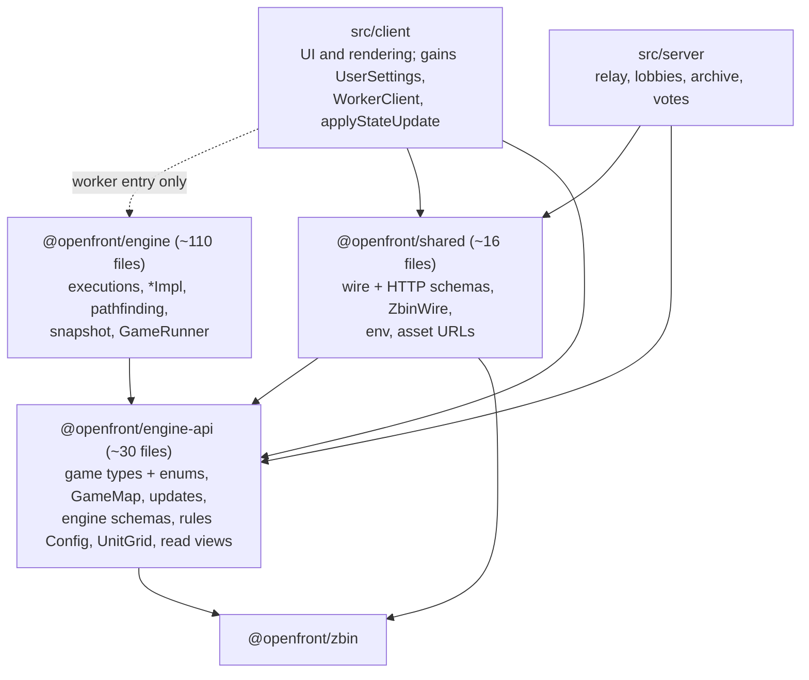

# Implementation: single-PR package split for #1701

Status: planned (2026-10-05). Tracks [#1701](https://github.com/openfrontio/OpenFrontIO/issues/1701).

One PR turns `src/core` into three npm workspace packages, `@openfront/engine-api`, `@openfront/engine` and `@openfront/shared`, with no behaviour change. It's built as ordered commits: the code changes first, each small enough to read, then one generated commit that only moves files. Analysis is against `main` at `89fe8a704`.

## Scope and exit criteria

**In scope:**

- Remove all 14 core → client imports.
- Split `Game.ts`, `Schemas.ts`, `Util.ts`, `Config.ts` and `AssetUrls.ts` along the engine/shared line.
- Add read interfaces so the client runs rules on its views without importing the engine.
- Move the files, set up the workspaces and per-package tsconfigs, and add a boundary test.

**Out of scope** (follow-up PRs):

- The Node engine host and `EngineProcess`.
- Winner-dispute replays and vote-summary logging.
- Moving `src/client` or `src/server`.
- Making the engine emit raw numbers instead of formatted message strings.

**Done when:**

- [ ] Nothing in `packages/engine` or `packages/engine-api` imports `src/client`, `src/server` or `packages/shared`.
- [ ] `src/client` and `src/server` import `@openfront/engine` only through the worker entry.
- [ ] Tick traces (engine hash, update-stream hash, periodic full-snapshot hash) are identical to the pre-refactor baseline on every tick of every test game.
- [ ] Wire frames are byte-identical: the zbin tests pass unchanged.
- [ ] `tsc`, `npm test`, `npm run lint`, `npm run build-prod` and a Docker build all pass.
- [ ] Dev smoke test passes: singleplayer, a two-tab private lobby, a replay, and the build menu.

## Decisions taken

These are defaults for the plan's open questions, chosen to keep the PR moving. Any of them can be flipped in review.

1. **Names and location.** `packages/engine-api` → `@openfront/engine-api`, `packages/engine` → `@openfront/engine`, `packages/shared` → `@openfront/shared`. `zbin/` becomes `packages/zbin` → `@openfront/zbin`, because the engine's schemas use `zb` annotations. `src/client` and `src/server` stay where they are, in the root package.
2. **Paths inside a package mirror today's.** `src/core/game/GameMap.ts` becomes `packages/engine-api/src/game/GameMap.ts`, so the move is one destination per file and reviewers can check it from `moves.json` alone.
3. **Packages ship TypeScript source.** Each `package.json` has `"exports": {"./*": "./src/*.ts"}` and no build step. Vite, Vitest, `tsx` and `tsc` (with `moduleResolution: bundler`) already resolve that.
4. **Allowed imports.** `engine-api` imports only `zod`, `jose`, `@openfront/zbin` and `resources/*.json`. `engine` adds `engine-api`. `shared` may import `engine-api`, but never `engine`. Client and server import `engine-api` + `shared`, and `engine` only through its worker entry.
5. **One temporary exception:** `src/client/replay/processor/` runs `createGameRunner` inside its own worker and may import `@openfront/engine`. It's listed in the boundary test, and the engine-host follow-up removes it.
6. **`jose` is allowed in `engine-api`,** for `base64url` decoding in the cosmetic pattern schema. That's pure and deterministic. `dompurify` (needs a DOM) and `nanoid` (random) are not.
7. **Formatters move into `engine-api`.** `renderNumber`/`renderTroops` keep producing the same strings, so game messages and replays don't change.
8. **No re-export shims.** Every importer is rewritten, so the old paths stop existing in the same commit.
9. **Tests stay in `tests/`.** The codemod rewrites their imports; reorganising them is out of scope.

## Target layout

The engine becomes a sealed box that only the browser worker loads; everything else talks to it through about 30 files in `engine-api`. The server imports no `@openfront/engine` code at all.



Arrows point at what a package may import. Shared importing `engine-api` is allowed and needed, because wire messages embed intents and `GameConfig`; the reverse is never allowed. The only other way into `engine` is the temporary replay-processor exception (decision 5).

| Package            | From today's `src/core`                                                                                                                                                                                                                                                                                                                                                                                                                                                             | New or split files                                                   |
| ------------------ | ----------------------------------------------------------------------------------------------------------------------------------------------------------------------------------------------------------------------------------------------------------------------------------------------------------------------------------------------------------------------------------------------------------------------------------------------------------------------------------- | -------------------------------------------------------------------- |
| `engine-api` (~30) | `Game.ts` types + enums, `GameMap`, `GameMapLoader`, `TerrainMapLoader`, `GameUpdates`, `GameUpdateUtils`, `MotionPlans`, `UnitGrid`, `Veterancy`, `DoomsdayClock`, `TeamAssignment`, `TileSet`, `Stats`, `Maps.gen`, `TerraNulliusImpl`, `Config` (rules), `execution/Util` (rules), `Schemas` (engine half), `StatsSchemas`, `PatternDecoder`, `EventBus`, `PseudoRandom`, `DetMath`, `Util` (engine half), `pathfinding/types`, `snapshot/SnapshotType`, `worker/WorkerMessages` | `game/ReadViews.ts`, `Format.ts`, `CosmeticRefs.ts`, `AssetPaths.ts` |
| `engine` (~110)    | everything else: the `Game`/`Player`/`Unit` interfaces, `*Impl`, `execution/*`, `pathfinding/*`, `snapshot/*`, `GameRunner`, `NationCreation`, the map loaders, `worker/Worker.worker.ts`                                                                                                                                                                                                                                                                                           | `NameBoxCalculator.ts` (from client)                                 |
| `shared` (~16)     | `ApiSchemas`, `ClanApiSchemas`, `CosmeticSchemas`, `ServerList`, `ClusterConfig`, `CloseCodes`, `AssetUrls`, `AnonNames`, `Base64`, `ZbinWire`, `WorkerSchemas`, `validations/username`                                                                                                                                                                                                                                                                                             | `WireSchemas.ts`, `SharedUtil.ts`, `Env.ts`                          |
| `src/client`       | `game/UserSettings`, `worker/WorkerClient`                                                                                                                                                                                                                                                                                                                                                                                                                                          | `PlayerState` + `applyStateUpdate` stay client-side                  |
| `zbin`             | `zbin/*` (5 files)                                                                                                                                                                                                                                                                                                                                                                                                                                                                  | none                                                                 |

Counts come from the import closure of what client and server use today, with the `Game.ts`, `Config`, `Util` and `Schemas` cuts from the commit plan applied. The boundary test recomputes it, so the final list is whatever the closure says.

## Commit plan

Eight commits. Every one compiles, passes `npm test` on its own and leaves the tick traces identical to the baseline, so the branch stays bisectable. Commits 2, 3, 5, 6 and 7 are partly or wholly generated by the codemod; their message records the exact command, so a reviewer can rerun it and diff. The boundary test from commit 1 carries an allowlist that shrinks commit by commit, which makes the progress visible in review.

1. **Tooling: boundary test, codemod, tick trace.** Add `tests/LayerBoundaries.test.ts`, `scripts/split-packages/` (see [The codemod](#the-codemod)) and the tick-trace script (see [Before/after tick check](#beforeafter-tick-check)), and record the baseline traces. The test assigns every `src/core` file to its future package via a map in the test, resolves every import, and fails on any edge outside the allowed graph unless it's in a frozen allowlist. The list starts with today's 14 core → client edges and every client/server import of a future-`engine` file. It also bans `Math.random`, `Date.now` and `new Date` in engine-bound files. No production code changes.
   - Verify: the test passes; adding a deliberate `import "../../client/Utils"` in an execution makes it fail.
2. **Relocate the files that live on the wrong side.** These are pure moves plus import rewrites, done with the codemod:
   - `client/hud/NameBoxCalculator.ts` → `core/game/NameBoxCalculator.ts`; its only user is `GameRunner`.
   - `core/game/UserSettings.ts` → `client/UserSettings.ts`. Its `GraphicsOverrides`, `StatsConstants` and `DesktopShell` imports become client-internal.
   - `core/worker/WorkerClient.ts` → `client/WorkerClient.ts`.
   - `core/validations/username.ts` → `client/validations/username.ts`. Only the client uses it, so its `translateText` import becomes legal as-is.
   - One hand edit: drop `Config`'s `_userSettings` constructor parameter and `userSettings()`, which nothing calls. That touches `GameRunner` (2 call sites), `ClientGameRunner`, `ReplayViewer` and 10 test files.
   - Verify: 5 of the 14 core → client edges are gone from the allowlist (NameBoxCalculator, the 3 UserSettings imports, translateText).
3. **Move the misplaced functions.** These are symbol moves: the declaration is cut and pasted by hand, and the codemod rewrites every importer.
   - `renderNumber`, `renderTroops` and their helpers go from `client/Utils.ts` to a new `core/Format.ts`, unchanged.
   - `applyStateUpdate` goes from `core/game/GameUpdateUtils.ts` to `client/view/PlayerStateUpdate.ts`, removing the `PlayerState` type import. The rest of `GameUpdateUtils` (`diffPlayerUpdate`, `packAttackTroopDeltas`, the delta constants) stays, because `GameImpl`/`PlayerImpl` use it.
   - Verify: core → client is down to the 4 view edges; `AttackLogicGolden` and message-formatting tests pass byte-for-byte.
4. **Read interfaces.** This is the only real design change. Add `core/game/ReadViews.ts` with `PlayerLike`, `UnitLike` and `GameLike`, typed as exactly the members that `Config`, `UnitGrid`, `execution/Util` and `GameImpl`'s unit predicate call. That's about 8 player methods, 10 unit methods and 15 game/map methods today. `Player extends PlayerLike` and `Unit extends UnitLike` in `Game.ts`; `PlayerView`, `UnitView` and `GameView` declare `implements` so `tsc` catches drift. Every `Player | PlayerView` / `Unit | UnitView` / `Game | GameView` union becomes the `*Like` type.
   - Verify: the core → client allowlist is empty; tick traces identical to the baseline.
5. **Split `Game.ts`.** Enums and plain data types (`UnitType`, `PlayerType`, `GameMapType`, `Difficulty`, `Gold`, `Tick`, `PlayerInfo`, `UnitInfo`, `Cell`, `TerrainType`, …) move to `core/game/GameTypes.ts` as a symbol move. `Game.ts` keeps the engine's `Game`/`Player`/`Unit`/`Execution`/`Alliance` interfaces, which reference `RailNetwork`, `AbstractGraph`, `PathFinder` and `SnapshotWriter`. `UnitInfo.cost` takes `(GameLike, PlayerLike)`. This cut is what keeps pathfinding, rail and snapshot out of `engine-api`: today `Game.ts` → `RailNetwork` → `RailNetworkImpl`/`TrainStation` → `TrainExecution` drags all 19 pathfinding files into the public surface.
   - Verify: the engine-api closure computed by the boundary test contains no `execution/`, `pathfinding/` or `*Impl` file except the listed rules files; `tsc` is green.
6. **Split the mixed files by audience** (symbol moves into new files):
   - `Schemas.ts` → engine half stays (IDs, `GameConfig`, intents, `StampedIntent`, `Turn`, `GameStartInfo`, `Player`, `Winner`, stats refs). The client↔server half goes to new `WireSchemas.ts`: `ClientMessage`, `ServerMessage`, lobby messages, `GameRecord`/`PartialGameRecord`/`PlayerRecord`, `PlayerReport`, `CLIENT_ID_MAPPING`.
   - `CosmeticSchemas.ts` → the four refs `Schemas` needs (`CosmeticNameSchema`, `PatternDataSchema`, `ColorPaletteSchema`, `EffectTypeSchema`) go to new `CosmeticRefs.ts`.
   - `Util.ts` → engine-safe helpers stay (`within`, `simpleHash`, `assertNever`, `toInt`, `sigmoid`, bounding boxes, `flattenedEmojiTable`, `formatPlayerDisplayName`, `LOBBY_LABEL_MAX`, …). The `dompurify`/`nanoid`/record helpers go to new `SharedUtil.ts`: `sanitize`, `onlyImages`, `generateID`, `generateGameID`, `createRandomName`, `createPartialGameRecord`, `decompressGameRecord`, `toWireGameStartInfo`, `replacer`, `sanitizeClanTag`, `sanitizeLobbyLabel`.
   - `Config.ts` → `GameEnv`, `parseGameEnv`, `JwksSchema` and the `window.BOOTSTRAP_CONFIG` global declaration go to new `Env.ts`.
   - `AssetUrls.ts` → the pure path builders (`AssetManifest`, `encodeAssetPath`, `normalizeAssetPath`, `buildAssetUrl`) go to new `AssetPaths.ts`. `Worker.worker.ts` builds map URLs from the manifest and CDN base it already receives in `init`, instead of reading globals through `assetUrl`.
   - Verify: zbin round-trip tests pass unchanged; no engine-bound file imports `dompurify`, `nanoid` or a shared-bound file.
7. **The move (generated).** Add `"workspaces": ["packages/*"]`, four `package.json`s, `tsconfig.base.json`, then run the codemod with `moves.json`. Every `src/core` file and `zbin/*` gets a `git mv` into its package, and every specifier in `src/`, `tests/`, `scripts/` and `vite.config.ts` is rewritten (including `vi.mock` paths and the `?worker&inline` import). The same commit makes the config edits the move forces (see [Tooling](#tooling-changes-the-move-forces)). The boundary test's map switches from the in-test assignment to package directories, and the allowlist shrinks to the replay-processor exception.
   - Verify: `git show --stat -M` shows 100% renames for every moved file; the non-rename diff is import specifiers plus the listed config files; rerunning the codemod is a no-op.
8. **Tighten.** Per-package `tsconfig.json`s: `engine` and `engine-api` use `lib: ["ES2022"]`, no DOM, no `@types/node`, plus a 5-line `globals.d.ts` for `console` and `performance`. `Worker.worker.ts` gets its own tsconfig with the `WebWorker` lib. Add `npm run typecheck` (root `tsc --noEmit` + each package) to `ci.yml`. Update `CLAUDE.md`, `docs/Architecture.md`, `README.md` and `CONTRIBUTING.md`.
   - Verify: a `window` reference in an execution fails `npm run typecheck`.

## The codemod

One script, `scripts/split-packages/run.ts`, built on the `typescript` compiler API (already a dependency) and run with `tsx`. It only rewrites import specifiers and runs `git mv`; it never edits declarations, so its output is easy to trust. It's deleted in a follow-up PR once the split has landed.

**Input: `moves.json`, one file per commit that uses it.**

```json
{
  "files": {
    "src/core/game/GameMap.ts": "packages/engine-api/src/game/GameMap.ts"
  },
  "symbols": [
    {
      "from": "src/core/game/Game.ts",
      "to": "src/core/game/GameTypes.ts",
      "names": ["UnitType", "PlayerType"]
    }
  ]
}
```

**What it does:**

1. Builds a `Program` from the root tsconfig covering `src/`, `tests/`, `scripts/`, `packages/` and `vite.config.ts`.
2. Visits every module reference: `import`/`export … from`, `import type`, `import()`, `vi.mock`/`vi.importActual`/`vi.doMock` string arguments, and specifiers with Vite queries (`?worker&inline`). It resolves each one with the compiler's own resolver.
3. **File moves:** if the target moved, it writes the new specifier. Inside the same package it stays relative; across a package boundary it becomes `@openfront/<pkg>/<path>` with no extension; from a package to the root app it's an error, because that edge is forbidden.
4. **Symbol moves:** splits the import declaration by name, keeping `type` modifiers, aliases and order. `import { UnitType, Game } from "./Game"` becomes two declarations, one per source file. Namespace imports and `export *` of a split file are flagged for a hand fix rather than guessed.
5. Runs `git mv` for each file move, after rewriting specifiers inside the moved files relative to their new location.
6. Prints a summary (files moved, specifiers rewritten per file, anything flagged) and exits non-zero if anything is flagged.

**How it's checked:**

- Idempotent: a second run on its own output changes nothing.
- `tsc --noEmit` and `npm test` pass straight after a run.
- For commit 7: `git diff -M --stat` lists every moved file as a 100% rename or a rename whose only changes are import lines. A small script asserts that from `git diff -M -U0`, so reviewers don't have to eyeball 600 files.
- Merge-day procedure: reset the branch's commit 7, rebase commits 1–6 on fresh `main` (fixing conflicts by hand there, where they're small), rerun the codemod, rerun the gates, and merge immediately.

## Tooling changes the move forces

All of these land in commit 7 except where noted. CI only builds Docker in `deploy.yml`/`release.yml`, so this table is the main defence against a green PR that breaks on deploy.

| File                                                                | Change                                                                                                                                                                                                                                                           |
| ------------------------------------------------------------------- | ---------------------------------------------------------------------------------------------------------------------------------------------------------------------------------------------------------------------------------------------------------------- |
| `package.json`                                                      | `"workspaces": ["packages/*"]`; root keeps its dependencies. Lockfile regenerated with `npm install --package-lock-only --ignore-scripts`                                                                                                                        |
| `packages/*/package.json`                                           | `name`, `"private": true`, `"type": "module"`, `"exports": {"./*": "./src/*.ts"}`, and the package's own deps (`engine-api`: `zod`, `jose`, `@openfront/zbin`; `shared`: adds `dompurify`, `nanoid`, `@openfront/engine-api`; `engine`: `@openfront/engine-api`) |
| `tsconfig.base.json` (new)                                          | Today's compiler options plus `paths` for `resources/*`. Root `tsconfig.json` extends it and swaps `zbin/**/*` for `packages/**/*` in `include`                                                                                                                  |
| `packages/*/tsconfig.json`                                          | Extend the base; in commit 8 they narrow `lib`/`types` for `engine` + `engine-api`                                                                                                                                                                               |
| `Dockerfile` (build + prod-deps stages)                             | Copy each `packages/<pkg>/package.json` before `npm ci`, so npm can link the workspaces                                                                                                                                                                          |
| `Dockerfile` (final stage)                                          | `COPY packages ./packages` beside `src`; drop `COPY zbin`                                                                                                                                                                                                        |
| `vite.config.ts`                                                    | `./src/core/AssetUrls` import becomes `@openfront/shared/AssetUrls`                                                                                                                                                                                              |
| `scripts/buildAssetHashes.ts`                                       | `coreVersion` hashes `packages/engine/src` + `packages/engine-api/src` (+ `packages/zbin/src`), with paths prefixed by package so renames still change the hash                                                                                                  |
| `eslint.config.js`                                                  | DetMath rule `files`/`ignores` globs move from `src/core/**` to `packages/engine*/src/**`                                                                                                                                                                        |
| `map-generator/codegen.go` (+ its README)                           | Output path for `Maps.gen.ts` becomes `packages/engine-api/src/game/Maps.gen.ts`; rebuild and confirm `npm run gen-maps` writes the same bytes                                                                                                                   |
| `.gitattributes`                                                    | Comment only: "hashes src/core" becomes the new paths                                                                                                                                                                                                            |
| `.github/workflows/claude-code-review.yml`                          | Path comment/filters that mention `src/core`                                                                                                                                                                                                                     |
| `.github/workflows/ci.yml`                                          | Commit 8: add `npm run typecheck`                                                                                                                                                                                                                                |
| `CLAUDE.md`, `docs/Architecture.md`, `README.md`, `CONTRIBUTING.md` | Commit 8: new layout, the import rules, and "all engine changes need tests" pointing at `packages/engine`                                                                                                                                                        |
| `.git-blame-ignore-revs` (new)                                      | Lists commit 7, added after merge since the SHA changes on merge                                                                                                                                                                                                 |

## Before/after tick check

Every commit must leave the simulation bit-for-bit unchanged. We prove it by running the same games before the refactor and after each commit, and comparing a trace tick by tick. Any difference on any tick fails.

**Trace script:** `scripts/split-packages/tick-trace.ts`, added in commit 1. Later commits rewrite its imports like any other file. It runs a game headless through `GameRunner` in Node, with the disk map loader from the perf tests, and writes one JSONL line per tick:

- `tick`.
- The engine's own state hash, on the ticks where it emits one (every 10).
- A sha256 of that tick's `GameUpdate` batch, serialized canonically: sorted keys, bigints as strings, typed arrays as plain arrays.
- Every 100 ticks, a sha256 of the full `snapshotGame` bytes.

The built-in hash alone is too weak. It sums `troops + tiles` and unit hashes per player, so a changed message string, or two moves that cancel out, wouldn't show. The update-stream hash catches anything a client would see. The snapshot hash catches hidden state: executions, RNG position, pathfinder caches.

| Game                 | Source                                         | Length           |
| -------------------- | ---------------------------------------------- | ---------------- |
| 1v1                  | Prod record, intents replayed                  | Full game        |
| Team game            | Prod record, intents replayed                  | Full game        |
| Large FFA            | Prod record, intents replayed                  | Full game        |
| Nations only, 2 maps | Synthetic: fixed seed, Hard nations, no humans | 6,000 ticks each |

Prod records are fetched once by game ID and cached in a gitignored directory, not committed.

**Procedure:**

1. At commit 1, run every game and save the traces as the baseline (`tick-trace --out .tick-baseline/`). Also check that each prod game's trace matches the hashes stored in its record, which proves the harness reproduces real games; pick records from a build whose sim matches `main`.
2. After each later commit, run `tick-trace --compare .tick-baseline/`. It reports the first differing tick, which field differs, and the update types in that tick's batch.
3. On merge day, regenerate the baseline from the rebased commit 1 before rerunning the comparison on commit 8.

## Verification gates

Run on the final branch after the merge-day regeneration; the first five also run on every commit.

- [ ] `tsc --noEmit` and `npm run typecheck` (per-package configs)
- [ ] `npm test`, including `tests/server`
- [ ] `npm run lint`
- [ ] Tick check: `tick-trace --compare .tick-baseline/` passes for all five games
- [ ] Boundary test strict: the allowlist holds only the replay-processor exception
- [ ] Codemod idempotent, and the move-commit diff check passes (renames + import lines only)
- [ ] Clean install: delete `node_modules`, run `npm run inst`, and confirm `node_modules/@openfront/*` link to `packages/*`
- [ ] `npm run build-prod` succeeds and writes `static/core-version.txt`
- [ ] `docker build .` succeeds; the container boots and serves `/desktop/version.json` with a `coreVersion`
- [ ] Bundle: the main client chunk contains no executions or pathfinding, and total size is within a few KB of `main`
- [ ] `npm run gen-maps` produces no diff
- [ ] `npm run dev` smoke test: singleplayer start, build-menu preview, nuke preview, a private lobby across two tabs, the replay viewer
- [ ] Merge with **Create a merge commit**, not squash, so the eight commits survive on `main`

## Gotchas found while researching

| Gotcha                                                                                                                               | Handling                                                                                                                                                                                                                                             |
| ------------------------------------------------------------------------------------------------------------------------------------ | ---------------------------------------------------------------------------------------------------------------------------------------------------------------------------------------------------------------------------------------------------- |
| `main` squash-merges by default, which would fold the eight commits into one                                                         | Use "Create a merge commit" (allowed in repo settings; `rebase` is not). Then `.git-blame-ignore-revs` can list only commit 7, and bisect keeps the logic commits separate                                                                           |
| CI never builds Docker; only deploy/release do                                                                                       | The Docker gate is run by hand, and the Dockerfile changes are in the tooling table                                                                                                                                                                  |
| The final image deletes `resources/maps` ("not used by the server")                                                                  | Fine for this PR. The engine-host follow-up must keep the maps, or server-side replays can't load them                                                                                                                                               |
| `node_modules/@openfront/*` are symlinks into `packages/`                                                                            | The final image must copy `packages/`, or the links dangle and the server dies at boot                                                                                                                                                               |
| `zbin` is imported by its root (`../../zbin`), not a subpath                                                                         | `packages/zbin/package.json` also exports `".": "./src/index.ts"`                                                                                                                                                                                    |
| `WorkerClient` imports the worker as `./Worker.worker.ts?worker&inline`                                                              | After the move it becomes `@openfront/engine/worker/Worker.worker?worker&inline`. Vite should strip the query before resolving the export; confirm in commit 7. Fallback: a relative path into `packages/engine`, allowlisted for that one specifier |
| `Schemas.ts` ↔ `CosmeticSchemas.ts` ↔ `PatternDecoder.ts` form a cycle today, type-only (`PlayerPattern`), so it's elided at runtime | `CosmeticRefs.ts` removes it. Any split that changes module evaluation order can surface "cannot access X before initialization" only at runtime, so the dev smoke test and a server boot are required gates                                         |
| `Config` takes `Player \| PlayerView`; views must satisfy `PlayerLike` structurally                                                  | Return types are covariant: `owner()` on a view returns a view, which is fine if it satisfies `PlayerLike`. Mismatches get small adapter methods on the view, never engine changes                                                                   |
| `TerraNulliusImpl` is used by the client but implements an engine interface                                                          | `TerraNullius` (four methods: `isPlayer`, `id`, `clientID`, `smallID`) moves to `GameTypes.ts` with it                                                                                                                                               |
| 34 files import via the `src/*` alias, and 11 tests `vi.mock` core paths                                                             | The codemod rewrites both; the `src/*` alias stays for client/server                                                                                                                                                                                 |
| The engine's built-in hash runs every 10 ticks and only sums troops, tiles and units per player                                      | The tick trace adds an update-stream hash every tick and a full-snapshot hash every 100 ticks                                                                                                                                                        |
| Backports to the release branch that's current at merge time stop applying across the move                                           | Land just before a release cut, so the new branch already has the layout. Expect the backport bot to fail on the previous branch for files that moved                                                                                                |
| Open PRs touching `src/core` conflict                                                                                                | Post `moves.json` and the codemod command in the PR description, so authors can run it on their own branches                                                                                                                                         |

## Open questions

None of these block starting commits 1–6; question 1 matters on merge day.

1. **Merge method:** OK to use "Create a merge commit" for this one PR instead of squash?
2. **Landing window:** which release cut should this land just before, and is a short heads-up to authors of open `src/core` PRs wanted?
3. **Replay-processor exception:** fine to leave `src/client/replay/processor/` importing `@openfront/engine` until the engine-host PR, or should this PR move its sim loop into an engine worker entry too? That adds a real behaviour change to a refactor PR, so I'd leave it.
4. **Commit 8 (no-DOM tsconfigs):** keep it in this PR, or split it out if the `console`/`performance`/WebWorker typing gets fiddly?
