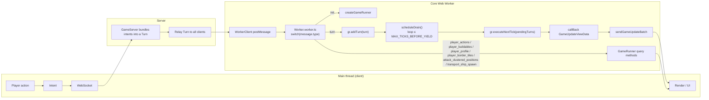
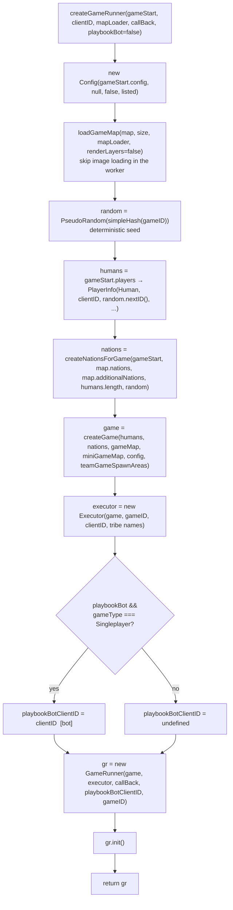
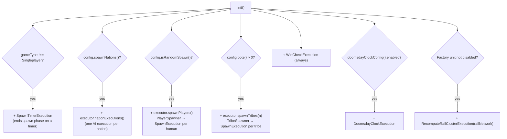
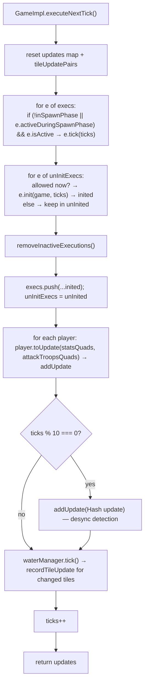
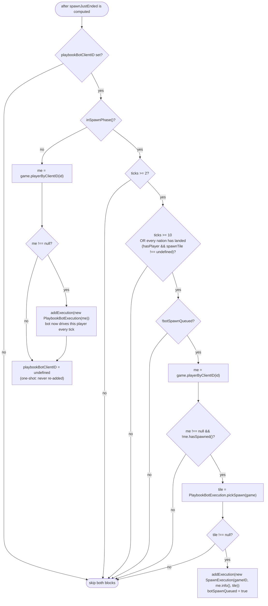
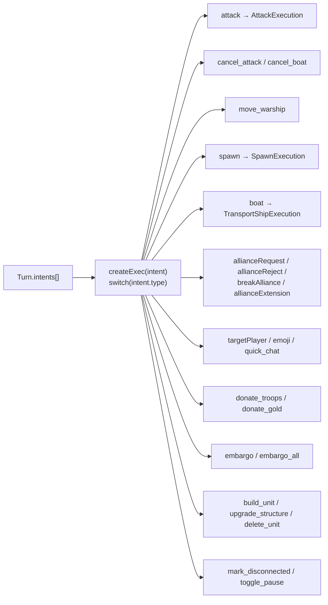
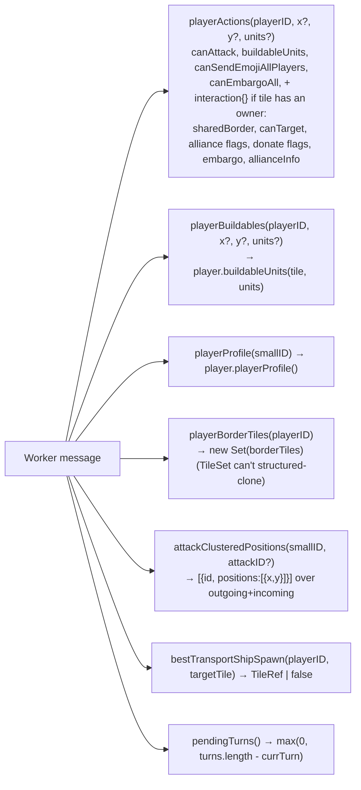

# OpenFront `GameRunner` logic

Source: `src/core/GameRunner.ts` (branch `playbook-bot`), plus the pieces it calls into
(`Worker.worker.ts`, `ExecutionManager.ts`, `GameImpl.executeNextTick`).
Nodes tagged **[bot]** exist only on the `playbook-bot` branch.

Paste into https://mermaid.live or view in any Markdown viewer with Mermaid support (GitHub, VS Code, Obsidian).

---

## 1. Where GameRunner lives — the round trip



---

## 2. `createGameRunner()` — construction



---

## 3. `init()` — the standing executions

Executions added once, before any turn. They live for the whole game.



---

## 4. `executeNextTick(pendingTurns)` — the per-tick loop (the heart)

```mermaid
flowchart TD
    Start(["executeNextTick(pendingTurns?)"])
    Start --> G1{isExecuting?}
    G1 -- yes --> R0([return false])
    G1 -- no --> G2{"currTurn >= turns.length?<br/>(no turn buffered)"}
    G2 -- yes --> R0
    G2 -- no --> Lock["isExecuting = true"]

    Lock --> T1["game.addExecution(...executor.createExecs(turns[currTurn]))<br/>one Execution per intent in the Turn"]
    T1 --> T2["currTurn++"]
    T2 --> T3["wasInSpawnPhase = game.inSpawnPhase()"]

    T3 --> Try{{"try"}}
    Try --> T4["t0 = performance.now()<br/>updates = game.executeNextTick()<br/>tickExecutionDuration = now - t0"]
    Try -. "catch" .-> Err["console.error<br/>callBack({errMsg, stack} as ErrorUpdate)<br/>isExecuting = false"]
    Err --> R1([return false])

    T4 --> V1["viewDataChanged = false"]
    V1 --> SP{game.inSpawnPhase()?}
    SP -- yes --> SPn["for each Human/Nation with a spawnTile:<br/>playerViewData[id] = placeSpawnName()<br/>viewDataChanged = true"]
    SP -- no --> SE
    SPn --> SE["spawnJustEnded = wasInSpawnPhase && !inSpawnPhase()"]

    SE --> BOT0{{"[bot] Playbook phase 0 — see §5"}}
    BOT0 --> BOT1{{"[bot] Playbook handoff — see §5"}}

    BOT1 --> NM{"spawnJustEnded<br/>|| ticks < 3<br/>|| ticks % 30 === 0?"}
    NM -- yes --> NMy["for every player:<br/>playerViewData[id] = placeName()<br/>viewDataChanged = true"]
    NM -- no --> Drain
    NMy --> Drain["drain packed buffers from game:<br/>packedTileUpdates<br/>packedMotionPlans<br/>packedPlayerUpdates<br/>packedAttackUpdates<br/>nukeImpacts → Uint32Array"]

    Drain --> CB["callBack({<br/>tick, packedTileUpdates,<br/>packedMotionPlans?, packedPlayerUpdates?,<br/>packedAttackUpdates?, packedNukeImpacts?,<br/>updates,<br/>playerNameViewData? (only if viewDataChanged),<br/>tickExecutionDuration,<br/>pendingTurns ?? 0 })"]
    CB --> Unlock["isExecuting = false"]
    Unlock --> R2([return true])
```

### 4a. Inside `game.executeNextTick()` (GameImpl)



Note: an execution added during tick N is *initialised* at the end of tick N and first *ticks* at N+1.

---

## 5. **[bot]** Playbook branch inside `executeNextTick`

Runs only when `playbookBotClientID` is set (dev `?bot=1`, singleplayer only).



Why `ticks >= 2`: nations land at ticks 2–3, and the picker wants to see where they are. `ticks >= 10` is the fallback so a nation that never lands can't block the bot's spawn forever.

---

## 6. `Executor.createExec(intent)` — Turn → Executions



---

## 7. Query methods (worker request → response, no state change)



---

## 8. State held by a `GameRunner` instance

| Field | Purpose |
|---|---|
| `game: Game` | the deterministic simulation |
| `execManager: Executor` | intent → Execution factory, nation/tribe/player spawners |
| `callBack` | where each tick's `GameUpdateViewData` (or `ErrorUpdate`) goes |
| `turns: Turn[]` / `currTurn` | buffered turns from the server; one consumed per tick |
| `isExecuting` | re-entrancy guard |
| `playerViewData` | cached name-box placements, only shipped when recomputed |
| `playbookBotClientID` **[bot]** | which player the bot owns; cleared after handoff |
| `botSpawnQueued` **[bot]** | phase-0 spawn issued exactly once |
| `gameID` | passed into the bot's `SpawnExecution` |
