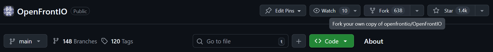

# Getting Started

## Prerequisites

- git
- npm (v10.9.2 or higher)
- A modern browser with developer tools
- github account
- discord account

Before you start, make sure you have all of these tools installed and ready to be used

Test by running in your terminal (or command prompt)

```bash
git --help
npm --help
```

You should see some help output. If you do, move on. If you don't try restarting your terminal, restarting your device, or reinstalling the tools.

## Discussing with the community

If you would like to make a change, especially a larger one (like a new feature, a large rewrite, or similar), you will need to discuss with the contributors and the maintainers on IF the change should be implemented, and potentially HOW it should be implemented. You may make a change without this discussion, but there is a much larger chance that it will require a lot of changes, or be straight up rejected.

The first step to becoming active in the community as a contributor is to request to join the development discord over at [https://discord.gg/K9zernJB5z]. It usually takes up to a few days to get accepted.

In the meantime while waiting, you can open an issue on the issues page. Make sure to fill it out thoroughly. You can then ask to be assigned in the comments of the issue.

Once you know what kind of changes you would like to make, you can move on to the next section.

## Making the change

If you are new to git, the first author of this file recommends you check out [this website](https://learngitbranching.js.org/?locale=en_US) for a visual way of learning how to use it.

### Setup

In github, fork [the repo](https://github.com/openfrontio/OpenFrontIO) onto your account.



Clone the repo, go into it, and set the upstream to the original repo.

```bash
git clone https://github.com/YourUsername/OpenFrontIO.git
cd OpenFrontIO
git remote add upstream https://github.com/openfrontio/OpenFrontIO.git
```

Install dependencies

```bash
npm i
```

Before making a change, make sure your local repo is up to date on the upstream and update your origin.

```bash
git checkout main
git fetch upstream --rebase
git push
```

If you would like to make a new change, create a new branch, and `checkout` into it

```bash
git checkout -b awesomefeature
```

### Editing files

You can now make a change and make a commit

```bash
git commit -m "add XYZ feature" path/to/file.ts
```

To test your change in-game, you can run any of the following

```bash
npm run dev
```

```bash
npm run start:client
```

```bash
npm run start:server-dev
```

### Cleaning up

Before publishing make sure to test your change manually, and then with npm, as you want to avoid creating regressions.

```bash
npm run test
```

Make sure your format also matches the one employed by the rest of the codebase

```bash
npm run format
```

or alternatively

```bash
npx prettier --write path/to/file
```

Lastly, make sure to lint your code

```bash
npm run lint
```

```bash
npm run lint:fix
```

Don't forget to commit your changes

```bash
git commit . -m "format"
```

### Publishing your change

Once you are happy with your commits, format your changes, and push them to origin. You cannot push directly to upstream (the official repo).

```bash
git push
```

Now, go to your repo on github, and create a pull request from your branch `YourUserName/OpenFrontIO/awesomefeature` to the main repo `OpenFrontIO/OpenFrontIO/main`.

Make sure to fill out the description properly before making a PR. If you are not ready to be reviewed yet, you can submit a "draft PR". As you push changes on your branch, the PR will be updated to match.

coderabbitai will then comment on your PR and suggest changes. If the changes are sensible, implement them.

Afterwards, if your PR is set as ready to be reviewed (not a draft) one of the maintainers will come and comment any needed changes. Discuss them further or implement the changes, and wait for another review.

Hopefully, afterwards, your change will be accepted, merged into main, and then later on, pushed out in an update to the live game!

## Next steps

- To learn more about our contribution guidelines, check out [the contribution page](contribute.md)
- To learn more about the structure of the codebase, go to [the development reference](develop.md)
